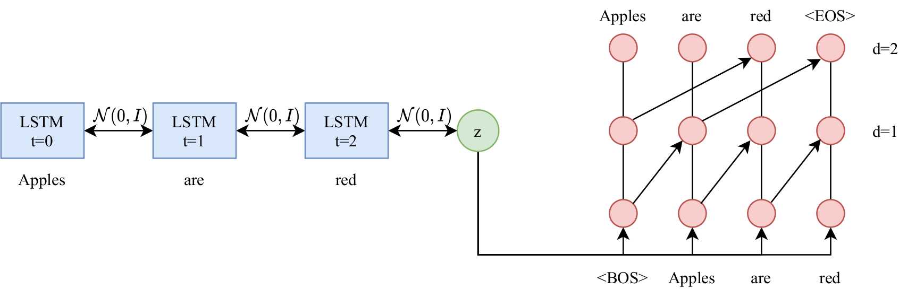

# Pytorch Recurrent Variational Autoencoder with Dilated Convolutions

## Model:
This is the implementation of Zichao Yang's [Improved Variational Autoencoders for Text Modeling using Dilated Convolutions](https://arxiv.org/abs/1702.08139)
with Kim's [Character-Aware Neural Language Models](https://arxiv.org/abs/1508.06615) embedding for tokens


Highly regularised model:<br />
[](images.vae.png)

Most of the implementations about the recurrent variational autoencoder are adapted from [analvikingur/pytorch_RVAE](https://github.com/analvikingur/pytorch_RVAE)

## Usage
### Set up the environment (Conda preferred):
```
conda env create --file env.yml
```
### Before model training it is necessary to train word embeddings:
```
$ python train_word_embeddings.py
```

This script train word embeddings defined in [Mikolov et al. Distributed Representations of Words and Phrases](https://arxiv.org/abs/1310.4546)

#### Parameters:
`--use-cuda`

`--num-iterations`

`--batch-size`

`--num-sample` –– number of sampled from noise tokens


### To train model use:
```
$ python train.py
```

#### Parameters:
`--use-cuda`

`--num-iterations`

`--batch-size`

`--learning-rate`
 
`--dropout` –– probability of units to be zeroed in decoder input

`--use-trained` –– use trained before model

`--regularised` –– use holistic regularisation in the encoder

### To test the model after training use:
```
$ python predict.py
```

#### Parameters:
`--use-cuda`

`--num-iterations`

`--batch-size`

`--regularised` –– use holistic regularisation in the encoder

### To sample data after training use:
```
$ python sample.py
```
#### Parameters:
`--use-cuda`

`--num-sample`

`--regularised` –– use holistic regularisation in the encoder

## Update 24/5/2020
- Compatibility with PyTorch 1.8.1
- Added highly regularised encoder (HR-VAE) inspired by [Li et al.](https://arxiv.org/pdf/1911.05343.pdf)
- Now the estimates for NLL are shown during training
- Added ability to test the model on test data (PTB by default)
